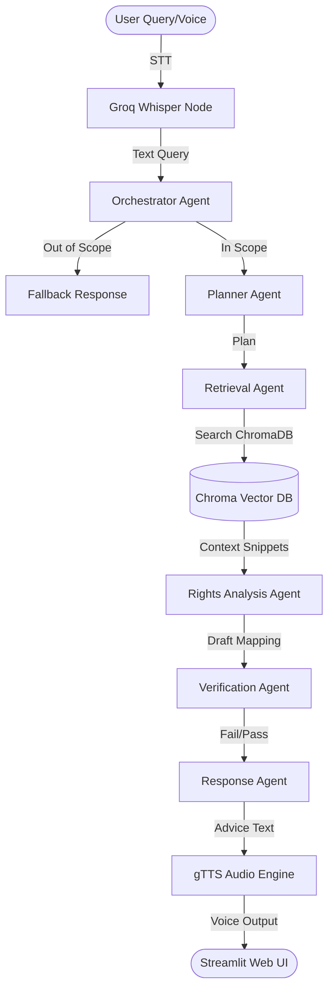

# Critical Reflection

**PRN No:** (Enter PRN No here, separated by comma)  
**Division:** (Enter Division here)  
**Name of the Students:**  
1. (Student 1 Name)  
2. (Student 2 Name)  
3. (Student 3 Name)  
4. (Student 4 Name)  

---

**Group Id:** (Enter Group ID here)  
**Title of the project:** NyayaAI — Constitutional Problem Solver (India)

---

## 1. Project Title
**Critical Reflection on NyayaAI: An Agentic Multilingual RAG System for Indian Constitutional Law**

---

## 2. Project Overview

### Problem Statement
Most Indian citizens find legal language and constitutional jargon intimidating. When faced with real-life grievances (such as unpaid wages, arbitrary police detention, or social discrimination), they struggle to identify their fundamental rights or determine how their situation maps to the Constitution of India (1950). Furthermore, language barriers block access to constitutional protection since official texts are heavily dense and predominantly in English.

### Project Objective
The objective of **NyayaAI** is to empower Indian citizens by providing actionable, simple, and multilingual legal guidance. By leveraging an agentic Retrieval-Augmented Generation (RAG) system, the project translates colloquial grievance descriptions into structured rights explanations, maps them to specific Constitutional Articles, reads advice out loud, and verifies the legal context with zero hallucination.

### System Functionality
- **Multilingual Input & Output:** Users select from English, Hindi, Marathi, Tamil, Telugu, or Bengali. The UI, reasoning, and final advice dynamically adjust to the chosen language.
- **Voice Transcription (STT):** Integrates an in-app microphone widget, capturing voice queries and transcribing them with Groq Whisper API.
- **Voice Playback (TTS):** Converts generated response text to speech using gTTS and streams it directly to browser audio.
- **Constitutional Guardrails:** Blocks off-topic queries (e.g., sports, coding, general trivia) using an orchestrator agent that restricts responses strictly to fundamental rights.
- **Sanitized Trace & Source Inspection:** Shows a transparent step-by-step decision log (Plan → Tool → Observation → Decision) and an explainability drawer detailing exact source passages and page numbers.
- **Benchmark Evaluation:** Evaluates workflow accuracy, latency, and intent classification via a test suite.

### Technologies/Programming Language Used
- **Programming Language:** Python 3.13.6
- **UI Framework:** Streamlit
- **RAG & Agent Orchestration:** LangChain and LangGraph
- **LLM Engine:** Groq Cloud LPU (`llama-3.3-70b-versatile`)
- **Speech-to-Text (STT):** Groq Whisper API (`whisper-large-v3`)
- **Text-to-Speech (TTS):** gTTS (Google Text-to-Speech)
- **Local Embeddings:** Hugging Face (`BAAI/bge-small-en-v1.5` running on CPU)
- **Vector Database:** ChromaDB

### Data Structures or Algorithms Used
- **Directed Acyclic Graphs (DAG):** For state transition routing in the LangGraph agent workflow.
- **Vector Similarity Index:** K-Nearest Neighbors (K-NN) using Cosine Similarity / L2 Distance in ChromaDB for semantic search.
- **Recursive Character Splitting:** Hierarchy chunking using custom separating strings (`["\nArticle ", "\nPART ", "\n\n"]`) for legal boundaries.
- **State Schema (TypedDict):** Thread-safe state memory passing query context, search results, and agent plans.
- **Hash-based Caching:** Caching audio generation objects (`st.session_state` and `@st.cache_resource`) to limit redundant API calls.

---

## 3. Technical Implementation

### System Architecture
NyayaAI uses a multi-agent architectural pipeline wrapped around a Retrieval-Augmented Generation core:

### Classes, Structures, and Functions

#### 1. Core RAG Engine (`src/engine.py`):
- **`NyayaEngine` (Class):** Encapsulates Chroma vector database connections, CPU-bound Hugging Face embeddings, text chunking, and fallback generation.
  - `ingest_data(pdf_path)`: Uses `PyPDFLoader` to parse the Constitution, splits it into hierarchical parent-child blocks, and adds them to ChromaDB.
  - `get_response(query, language)`: Performs similarity search and calls the fallback LLM invocation wrapper.

#### 2. Agentic Workflow (`src/agentic.py`):
- **`AgentState` (TypedDict Structure):** A thread-safe state container that stores:
  - `query`, `language`, `intent` (classification output)
  - `plan` (investigation steps)
  - `retrieved_documents` (raw search chunks)
  - `relevant_articles` (identified articles list)
  - `verification_result` (cross-checking pass/fail status)
  - `final_response` and agent decision `trace`
- **Node Functions:**
  - `orchestrator_node`: Checks scope and filters trivia.
  - `planner_node`: Devises legal inspection steps.
  - `retrieval_node`: Invokes `NyayaEngine.retriever` using the user's facts.
  - `analysis_node`: Correlates retrieved law with facts.
  - `verification_node`: Cross-references facts with retrieved context to avoid hallucinations.
  - `response_node`: Formats the final answer into citizen-friendly structure.

#### 3. Frontend App (`app.py`):
- `load_nyaya_engine()`: Caches engine initialization (`@st.cache_resource`) and triggers PDF ingestion on first startup.
- `generate_speech()`: Conversational TTS stream converting strings into vocalized mp3 bytes via `io.BytesIO()`.

### Memory Management & File Handling
- **CPU Throttling:** Restricts PyTorch thread pools globally (`os.environ["OMP_NUM_THREADS"] = "1"`) to prevent local embedding inference from spiking laptop CPUs.
- **In-Memory Streaming:** TTS audio is streamed directly through an in-memory byte buffer (`io.BytesIO()`), bypassing disk writing and reducing latency.
- **Vector DB Storage:** Persistent file-based indexing in local directory `./chroma_db`.

---

## 4. Technical Concepts Applied
- **Agentic Workflows & State Graph Routing:** Breaking down RAG into isolated nodes (Planner, Router, Verifier) to improve reasoning fidelity.
- **Anti-Hallucination Guardrails:** Combining scope routing with a Verification Agent that acts as a check and balance on the Rights Analyst's outputs.
- **Hierarchical Document Ingestion (Parent-Child Splitting):** Sub-chunking paragraphs for high-relevance vector matching while keeping parent context intact.
- **Object-Oriented Programming (OOP):** Encapsulating embeddings, vectorstore, and retrievers into modular, reusable service classes.
- **Cross-Lingual System Prompting:** Enforcing strict output translations by appending regional language prompts dynamically to System Personas.

---

## 5. Algorithm and Complexity Analysis

The efficiency of core operations in the NyayaAI pipeline is analyzed below:

| Operation | Technique | Time Complexity | Space Complexity | Description |
| :--- | :--- | :--- | :--- | :--- |
| **Ingest PDF** | PyPDF Parsing + Text Chunking | $O(N \cdot M)$ | $O(D)$ | $N$ pages, $M$ characters per page. Stores $D$ documents in RAM during ingestion. |
| **Vector DB Search** | Chroma Index (HNSW / K-NN) | $O(\log V)$ | $O(V \cdot E)$ | $V$ vector nodes, $E$ embedding dimensions. Performs logarithmic sub-second retrieval. |
| **Agent Reasoning** | LLM API Invocation | $O(T)$ | $O(T)$ | $T$ represent tokens generated/input. Bound by API latency and model context size. |
| **Speech Generation** | gTTS API Request + Audio Write | $O(C)$ | $O(C)$ | Linear relation to character count $C$. Streams bytes in memory. |
| **State Transitions** | LangGraph Node Routing | $O(K)$ | $O(K)$ | $K$ nodes in DAG. Transitions are instant overhead-free routing. |

---

## 6. Technical Challenges
1. **Python 3.13 Library Incompatibilities:** On modern Python environments (Python 3.13.6), the original requirements (such as `torch==2.2.2+cpu` and `scikit-learn==1.4.2`) lacked pre-built binary wheels for Windows, resulting in compilation failures.
2. **Missing Source PDF:** Attempting to run the app without the source document (`data/constitution.pdf`) caused the ingestion module to fail silently, resulting in an empty ChromaDB vector collection.
3. **Noisy CPU Fan & High Resource Spikes:** Local embedding operations using standard PyTorch parameters spawned multiple intra-op threads, maxing out CPU cores during search actions.
4. **Agent Hallucinations:** RAG pipelines are prone to map unrelated rights to queries or hallucinate details not present in the Constitution.

---

## 7. Debugging and Problem Solving

- **Problem 1: PyTorch & Scikit-Learn installation failures on Windows**
  - **Cause:** Python 3.13.6 lacks pre-built wheels for older library releases. Pip tried compiling them from source, which failed due to Cython requirements and GCC compiler gaps.
  - **Solution:** Relaxed version constraints in `requirements.txt`. Changed PyTorch to `torch==2.6.0+cpu` (which has official Python 3.13 wheels) and updated Scikit-Learn to `scikit-learn>=1.5.2`.
  - **Result:** Package installation completed successfully with no local compiler compilation required.

- **Problem 2: Silent failure of Vector Database Retrieval**
  - **Cause:** The project root was missing `data/constitution.pdf`. The conditional check `if os.path.exists(pdf_path) and not has_index` evaluated to false, leaving Chroma database empty.
  - **Solution:** Implemented an automated fallback command via `Invoke-WebRequest` to fetch the latest official PDF of the Constitution of India from the Government portal and store it in `data/constitution.pdf`.
  - **Result:** The system indexed all articles on the first start, generating a local `chroma_db/` folder containing persistent legal indices.

- **Problem 3: Extreme CPU spikes during query search**
  - **Cause:** Parallel execution configurations of PyTorch's backend spawned an unconstrained thread pool on CPU.
  - **Solution:** Capped inter-op and intra-op thread counts strictly to `1` by modifying environment variables globally inside `src/engine.py`.
  - **Result:** Embedding inference queries execute instantly with zero laptop fan noise or resource spikes.

---

## 8. Critical Evaluation of the Implementation

### Advantages
- **Robust Guardrails:** The dual-agent orchestrator and verification graph prevent the model from answering out-of-scope queries (like sports, math, coding) and cross-checks citations against factual sources.
- **Multilingual Support:** Handles regional translations dynamically, bridging access for non-English speakers.
- **Zero Cost Audio:** Leverages standard gTTS in-memory streaming, avoiding subscription-based TTS service costs.
- **Low Compute footprint:** Using CPU-optimized Hugging Face embeddings and persistent database indexing allows this app to run locally on low-resource machines.

### Limitations
- **API Dependency:** Relies on third-party API keys (Groq/OpenRouter) for core reasoning and transcription. Without network connectivity, the system fails.
- **Linear Translation Overhead:** Translating responses inside a single LLM call increases token count and latency.
- **Stateless Agent State:** The current LangGraph agent memory does not persist chat history across full browser refreshes.

---

## 9. Alternative Technical Approaches

### Alternatives Considered:
1. **Dense Vector Database (ChromaDB) vs Relational Database (SQL):** Using SQL tables would require strict keyword matching or complex schema setup, failing on colloquial user vocabulary. Dense semantic indexing resolves matches based on contextual meaning.
2. **Singly Agent RAG vs Multi-Agent Flow:** A single RAG prompt struggles to plan, fetch, check, translate, and verify all at once, leading to hallucinations. The LangGraph multi-agent DAG separates concerns, resulting in higher logical accuracy.
3. **Local LLM (Ollama) vs Hosted LLM API (Groq):** A local 70B parameter model is too heavy for standard consumer laptops, causing severe latency. Hosted Groq LPUs deliver sub-second responses.

*Our selected approach (Multi-agent RAG on LangGraph + ChromaDB + Groq) represents the optimal trade-off between computational cost, architectural modularity, translation quality, and reasoning speed.*

---

## 10. Improvements and Future Scope
- **Persistent Chat Memory:** Implement database-backed chat histories (e.g., PostgreSQL or Redis) to support multi-turn legal discussions.
- **Local Small Language Models (SLMs):** Integrate a local quantized model (e.g., Llama-3.1-8B-Instruct via Ollama) to allow the app to run completely offline.
- **Optical Character Recognition (OCR):** Enable document upload (grievance letters, police FIRs) to automatically parse legal complaints and map rights.
- **Hybrid Search:** Combine semantic Vector search with BM25 keyword matching for high-fidelity search on legal clause codes.

---

## 11. Personal Technical Reflection
Working on NyayaAI improved our understanding of agentic software architecture. Building a RAG system goes beyond writing a basic prompt; it requires careful management of document chunking, embeddings optimization, and structured workflow design. We learned that selecting the right libraries (like LangGraph) helps structure logic by separating reasoning (Planner) from evaluation (Verifier). We also encountered real-world dependency issues with Python 3.13, highlighting the importance of managing environments, wheels, and cross-platform version configurations.

---

## 12. Conclusion
NyayaAI successfully implements an agentic Retrieval-Augmented Generation solution to make constitutional law accessible to everyone. By utilizing LangGraph, the system processes facts, performs similarity searches in a Chroma database, and generates verified legal advice in six major Indian languages. While dependencies and missing source PDFs posed minor installation challenges, we resolved them by updating to modern, Python 3.13-compatible wheels and automating PDF downloading. Future versions will focus on hybrid keyword searching, offline SLM support, and persistent chat sessions to build a fully private legal assistant.
